<div align="center">

<a href="https://sakura.52-198-144-26.sslip.io/">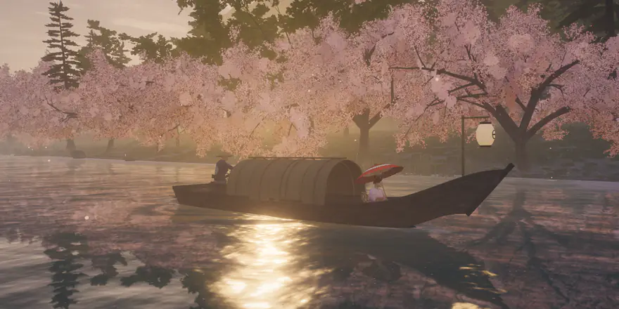</a>

<h1>桜幻想 &nbsp;<sub><i>Sakura Fantasy</i></sub></h1>

<p><b>日本の川の谷を、小舟でゆく。四季も時刻も思いのままに、<br>ブラウザの中でリアルタイムに描く。</b></p>

<p>
<a href="https://sakura.52-198-144-26.sslip.io/"><b>旅に出る</b></a> &nbsp;·&nbsp;
<a href="docs/ARCHITECTURE.md">しくみ</a> &nbsp;·&nbsp;
<a href="docs/SOUND.md">音楽</a> &nbsp;·&nbsp;
<a href="README.md">English</a> &nbsp;·&nbsp;
<a href="README.zh-CN.md">中文</a>
</p>

<p>
<a href="https://sakura.52-198-144-26.sslip.io/"></a>
<a href="https://threejs.org/"></a>


<a href="LICENSE"></a>
</p>

</div>

<br>

あなたは苫舟に座り、船頭が櫓を漕いで川を下ってゆく。舟は次の場所を順に過ぎる。

- 朝霧の瀬
- 桜並木
- 朱の太鼓橋
- 五重塔の里
- 竹林の峡谷
- 千本鳥居のトンネル
- 水に鳥居が立つ湖

そして季節が移り、旅はふたたび始まる。

木も花も草の一枚まで、日本の実在の植物をフォトグラメトリでスキャンしたものから描いている。光は一日の太陽の動きに従い、天気も変わる。音楽は旅の進みに合わせてその場で作曲され、箏・尺八・笙が奏でる。その背後には京都をはじめ各地の寺や庭で録った音が流れる。

コードは素の JavaScript でおよそ一万行。three.js の上に、エンジンもフレームワークも使わずに書いた。

<br>

<p align="center">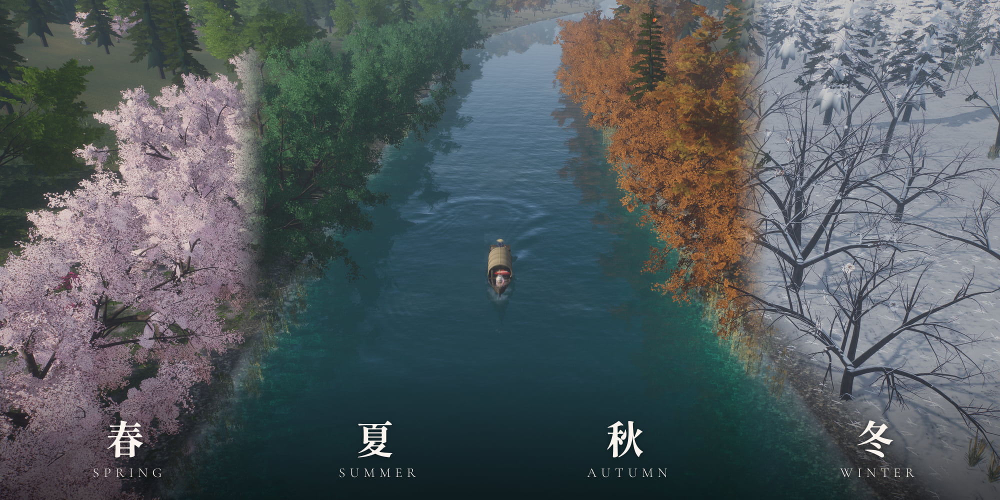</p>
<p align="center"><sub>同じ木々の一年。春に花が咲き、夏に緑となり、秋には葉が一枚ずつ色づき、冬は枝に雪が積もる。</sub></p>

## 旅路

<table>
<tr>
<td width="50%">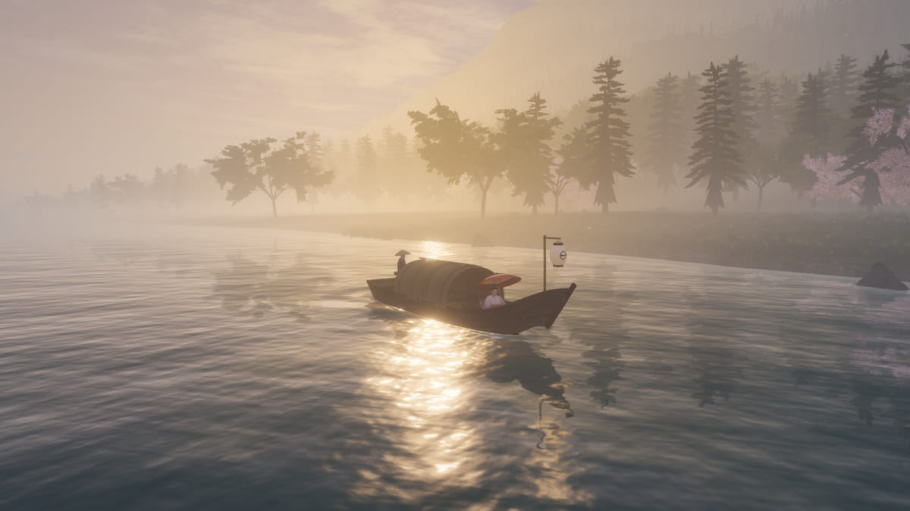<br><b>朝霧の瀬</b><br><sub>葦と河原の石、深い朝霧。</sub></td>
<td width="50%">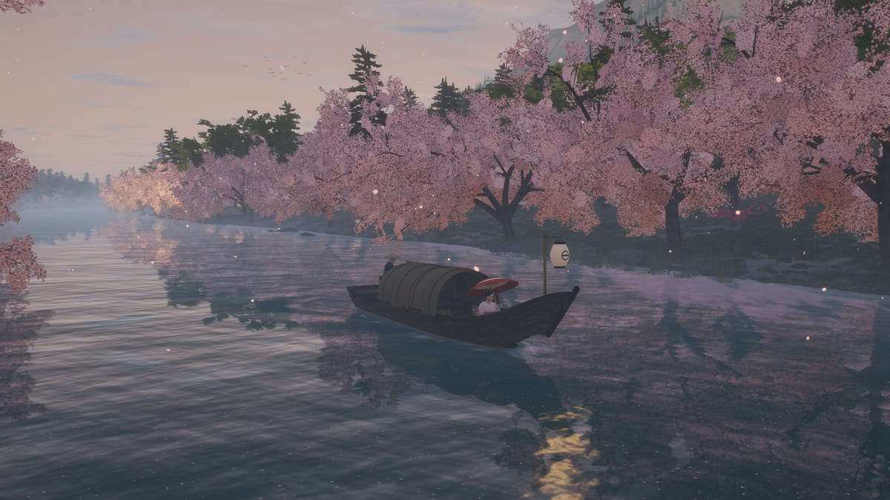<br><b>桜並木</b><br><sub>両岸に桜が並び、水面に花筏が浮かぶ。</sub></td>
</tr>
<tr>
<td>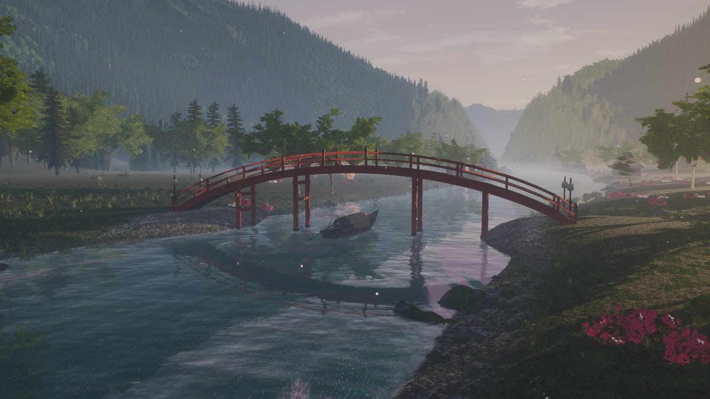<br><b>朱の太鼓橋</b><br><sub>舟は反り橋の下をくぐる。</sub></td>
<td>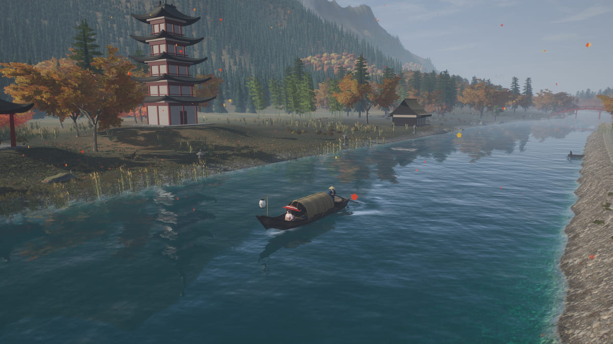<br><b>五重塔の里</b><br><sub>五重塔に本堂、鐘楼。舟が着くと鐘が鳴る。</sub></td>
</tr>
<tr>
<td>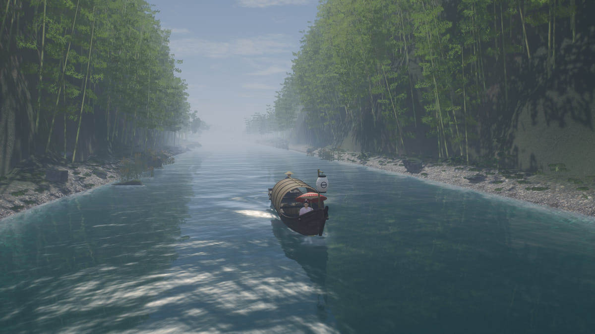<br><b>竹林峡</b><br><sub>切り立つ崖、竹の壁、そして滝。</sub></td>
<td>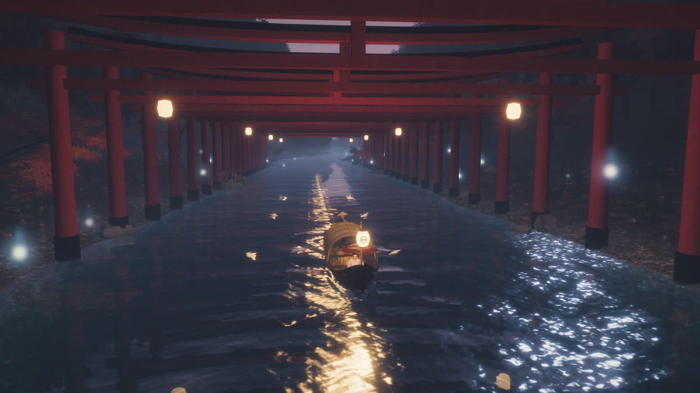<br><b>千本鳥居</b><br><sub>まっすぐな水路の上に、朱の鳥居が四十一基。</sub></td>
</tr>
<tr>
<td>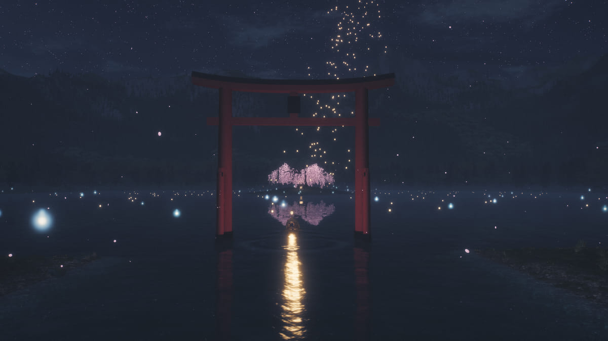<br><b>御神木の湖</b><br><sub>島に立つ桜の大樹と、水中の鳥居。</sub></td>
<td>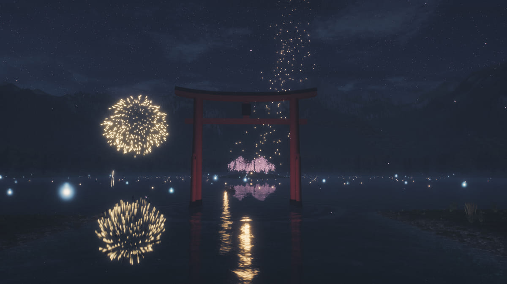<br><b>花火</b><br><sub>夏の夜だけ。音は音速で遅れて届く。</sub></td>
</tr>
</table>

それぞれの場所に着くと、その場所と季節にふさわしい古典の俳句が章の扉として開く。

## 中身

**本物の植物。** 日本の樹種の CC0 スキャンを使っている。

- 桜、もみじ、コナラ
- クロマツ、スギ
- 竹、ツツジ、ススキ、葦

葉・花・草は、これらのスキャンを Blender でカラー・AO・法線の写真アトラスに焼いたもの。木そのものはコードで生成し、インスタンスで描く。川からの距離で三段階に詳細度を変え、カメラが近づくとフル詳細に切り替わる。

**光と空気と天気。**

- どの時刻にも合う太陽と空、高さフォグと光芒
- 晴・霧・雨・嵐・雪の五つの天気
- 枝や屋根、岸に積もる雪

**水。** 川面は岸と空を映す。舟はケルビン航跡と船首波を残し、岸には泡が寄り、水面には花びらが浮かぶ。

**舟と人。**

- 舟は Blender で板一枚から組み上げた。
- 船頭と乗客の体は MPFB をもとにし、衣装はそれぞれのために仕立てた。船頭は半纏に菅笠、乗客は振袖に錦の帯で、赤い和傘を差す。
- 船頭は 2 ボーン IK で漕ぎ、ひと漕ぎごとに両手が櫓から離れない。

**夜。** 窓に灯がともり、狐火が漂い、湖には灯籠が流れ、島からは天灯が昇る。

**音。** 音は二つの層からなる。どの録音も、場所・季節・時刻に応じて鳴る。

| 層 | 聞こえるもの |
|---|---|
| 音楽 | 日本の音階（平調子・陽音階・雲井調子）でその場で作曲する。箏は手を組み合わせて弾き、橋の手前では段物を、春の桜の下では「さくらさくら」を引く。尺八は長い息で吹き、笙は社のあたりで合竹を響かせる。 |
| 録音 | 大原・来迎院と増上寺の梵鐘、京都の庭の水琴窟と鹿威し、蝉、鈴虫、鶯。 |

[音楽について →](docs/SOUND.md)

**なめらかに。** 谷はワーカーのプールで生成する。フレーム時間のガバナーが描画解像度を調整し、各フレームを予算内に収める。最初のフレームは軽量版で描き、高精細なアセットは後から読み込む。

## 操作

| | |
|---|---|
| <kbd>W</kbd> <kbd>S</kbd> / <kbd>↑</kbd> <kbd>↓</kbd> | 速く・遅く |
| <kbd>A</kbd> <kbd>D</kbd> / <kbd>←</kbd> <kbd>→</kbd> | 水路の中で舵を切る |
| ドラッグ · ホイール | 見回す · ズーム |
| <kbd>C</kbd> | カメラ：追従 → 座席 → シネマ |
| <kbd>Space</kbd> | 止まって漂う / 漕ぎ出す |
| <kbd>M</kbd> | 音のオン・オフ |
| <kbd>P</kbd> | 写真モード（周回カメラ、PNG 書き出し） |
| <kbd>H</kbd> | UI を隠す |

漢字のドックでは季節・時刻・天気・カメラ・音を選べる。旅の巻物を使えば、どの場所へも飛べる。

## 動かす

```sh
git clone https://github.com/billpwchan/sakura-fantasy.git
cd sakura-fantasy
npm install
npm run dev          # http://127.0.0.1:5190
```

`npm run build` を実行すると、静的サイトが `dist/` に出力される。どの Web サーバーでも配信できる。アセットはすべてリポジトリに入っているので、別途ダウンロードするものはない。

URL にパラメータを付けると、オープニングを飛ばして好きな場面を直接開ける。

| パラメータ | 意味 | 例 |
|---|---|---|
| `z` | 川に沿った位置。`40`（出発点）から約 `-2300`（湖）まで | `z=-1640` |
| `s` | 季節：`0` 春、`1` 夏、`2` 秋、`3` 冬 | `s=2` |
| `h` | 時刻、`0`–`24` | `h=17.5` |
| `w` | 天気：`clear` `mist` `rain` `storm` `snow` | `w=mist` |
| `mode` | カメラ：`follow` `seat` `cinema` | `mode=seat` |
| `cam`、`look` | 固定カメラの位置と注視点、`x,y,z` | `cam=4,3,-690&look=0,6,-720` |
| `tier` | `hi` は高精細アセットを読み込み、`lo` は軽量版のまま | `tier=lo` |
| `intro` | それでもオープニングを流す | `intro` |

たとえば：[秋の夕暮れの太鼓橋](https://sakura.52-198-144-26.sslip.io/?z=-660&s=2&h=17.2)、[冬の夜の里](https://sakura.52-198-144-26.sslip.io/?z=-860&s=3&h=21)。

## つくりかた

<p align="center">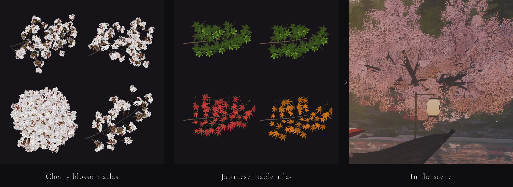</p>

| 文書 | 内容 |
|---|---|
| [docs/ARCHITECTURE.md](docs/ARCHITECTURE.md) | レンダラーとパス、1 フレームの流れ、ガバナー、ワールド生成、植生と LOD、舟と人物、夜、旅とカメラ、読み込みの段階 |
| [docs/SOUND.md](docs/SOUND.md) | 音楽：音階、箏の手、間と序破急、各楽器を無料の録音からどう作ったか、ミックスをどう測ったか |
| [pipeline/](pipeline) | アセットを作ったオフラインツール：植物アトラス・人物・舟・小物の Blender スクリプトと、音声のビルド |

### パフォーマンス

Apple M4 Max、1920×1080 @2× でフル詳細版を動かしたときの結果は次のとおり。

- **60 fps**
- p95 フレーム時間 18.4 ms
- ガバナーは川のほとんどで描画スケール 1.0 を保ち、いちばん重い桜並木でも 0.85〜0.95

スマートフォンとタブレットでは軽量版で動く。

## 構成

```
src/
├── main.js        起動、フレームループ、入力
├── core/          描画パス、ポスト処理、共有 uniform、ローダー
├── env/           時刻、季節、天気
├── world/         配置、地形、水、木、草、建物、小物、舟、人物、空
├── fx/            花びら、落ち葉、雪、雨、蛍、狐火、灯籠、花火
├── journey/       旅路、カメラ演出、俳句
├── audio/         音楽、環境音、サウンドバンク
└── ui/            ローダー、タイトル、章の扉、漢字ドック、About、写真モード
public/assets/     テクスチャとアトラス、モデル、KTX2 トランスコーダー、音声
pipeline/          オフラインのアセットツール（Blender、Node、Python）
scripts/           テクスチャ取得、性能計測とキャプチャ
deploy/            Docker + Caddy によるデプロイ
```

## クレジット

植物、テクスチャ、人物、録音のほとんどは CC0 かパブリックドメイン。石像二体と録音六つは CC BY。出典と作者はすべて [CREDITS.md](CREDITS.md) に記した。

Meng To の *Sakura River Valley* に着想を得たが、そのコードやアセットは一切使っていない。

## ライセンス

コードは [MIT ライセンス](LICENSE)。アセットはそれぞれのライセンスに従う。詳しくは [CREDITS.md](CREDITS.md) を参照。
