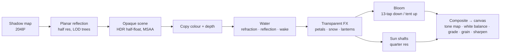

# How Sakura Fantasy works

This document explains how the app works: how the valley is built, how a frame is drawn, and the decisions that keep
it smooth. The code is plain JavaScript modules on top of three.js. It has no framework and no engine, and the only
runtime dependency is three.js.

```
src/
├── main.js        boot, the frame loop, input, the glue between systems
├── core/          renderer passes (pipeline.js), post chain (post.js), shared uniforms, textures
├── env/           time of day, season and weather → the shared uniforms
├── world/         valley layout, terrain, water, trees, grass, buildings, props, boat, people, sky
├── fx/            petals, leaves, snow, rain, fireflies, wisps, lanterns, fireworks
├── journey/       the voyage, the camera director, the haiku
├── audio/         the generative score and soundscape
└── ui/            loader, title, chapter cards, kanji dock, About, photo mode
```

## 1 · One set of uniforms

Every material reads the same uniforms (`core/shared.js`):
- sun and moon direction and colour;
- sky and ambient colours;
- fog and mist;
- a wind vector with a gust phase;
- **season weights** (`uSeason`: spring, summer, autumn, winter);
- snow, wetness, rain;
- night, the lightning flash, and up to ten point lamps.

`env/environment.js` owns time, season and weather. When something changes, it eases toward the new targets. Then,
once per frame, it writes the uniforms.

Because nothing is per-material, a change in season or weather reaches the whole frame:
- trees blend between their blossom, leaf, autumn and bare atlases;
- the ground grows snow on upward-facing surfaces;
- roofs darken when wet;
- the water picks up rain rings;
- the fog turns warm toward the sun.

There are five weathers (clear, mist, rain, storm, snow). Each is a set of targets, not a switch.

## 2 · A frame



`core/pipeline.js` runs the passes in order. Three choices shape it:

- **The water draws after the opaque scene, from a copy of it.**
  - Refraction samples the copied colour and depth, so the river shows the stones and logs actually beneath it. The
    water absorbs light along the true optical path, not a fixed tint.
  - Reflection is a separate half-resolution pass. It is read along each pixel's reflected ray, not at a shifted
    screen position, so ripples stretch reflections downward and break them the way real water does.
  - Ripples too fine for a pixel are not dropped. Their slope variance becomes roughness, which blurs the reflection
    mostly toward the viewer, by about 1/sin of the grazing angle. Far water reads as a rippled sheet, not a mirror.
    The blur is a single anisotropic fetch from the reflection's mip chain, its footprint set to that ellipse.
  - Roughness varies: gust patches drift downwind, the main current is rougher than the slack water by the banks,
    and the open lake mixes glassy and darker patches.
  - On top come the boat's Kelvin wake and bow wave, foam where the water meets the shore, bubble lines in the fast
    current, petals resting on the surface, and glint columns under every lantern and firework.
- **The reflection pass draws a cheaper world.** Trees reflect with their far LOD and grass is skipped (layer
  `LAYER_NOREFL`). Ripples hide the difference, and the pass costs a fraction of the main one. Effects that glow
  (lanterns, wisps, fireflies, fireworks) are on `LAYER_FXREFL` and draw in it too.
- **Post is one composite pass.**
  - Bloom is physically based: a 13-tap downsample chain, then a tent-filter upsample.
  - Sun shafts render at quarter resolution.
  - One shader to the canvas does tone mapping, white balance by time of day, a split grade, vignette, film grain,
    and a sharpening upscale from the render scale.

### The governor

The canvas is drawn at a **render scale** between 0.5 and 1.0 of device pixels. On a 4K screen at 2×, resolution
is most of what reads as sharpness, so the governor (in `pipeline.js`) keeps the scale as high as frames allow. It
judges full 1.5 s windows of frame times, by their p90 and their share of missed frames:
- It waits 6 s after load, while shaders compile and the GPU raises its clocks.
- When p90 is over budget it steps the scale down by 12%; when only a few frames miss, by 5%, so it settles just under
  what the GPU holds instead of well below it.
- After a run of clean frames, it probes back up. A probe that fails halves the next step and doubles the wait, so
  the scale settles instead of oscillating.
- It ignores lone stalls (a shader compiling, a texture uploading) and the frames its own resizes cost.

High-density screens get 2× MSAA instead of 4×: at 2× device pixels the two cannot be told apart, and the GPU time
goes to resolution instead. The composite upscales with a 5-tap Catmull-Rom filter, clamped to its neighbours so
bright edges do not ring, and sharpens more as the scale drops. On the M4 Max at 4K the cherry avenue, the heaviest
stretch, holds 0.85–0.95 and the rest of the river 1.0.

## 3 · The valley

`world/layout.js` defines:
- the river: control points become a centreline with a width and slope at every z;
- the lake (r 188 m) and its island;
- the flattened **pads** under every building;
- the seven **places** of the journey.

The terrain height function is pure, so the same code runs on the main thread and in workers.

**World generation runs off the main thread.** `world/generate.js` splits the valley's z range across a pool of
module workers (up to 10). Each worker builds terrain chunks (120 m, with columns dense at the water and stretching
out to the ridges) and places trees and ground cover. The results are transferred back and merged. Placement is
deterministic, so every visit grows the same valley.

| z (m) | Place | |
|---|---|---|
| +60 … −250 | 朝霧の瀬 Shallows of Morning Mist | wide, reeds and stones, heavy dawn mist |
| −250 … −620 | 桜並木 The Cherry Avenue | banks lined with sakura, petal rafts |
| ≈ −700 | 朱の太鼓橋 The Vermilion Drum Bridge | the boat passes under a vermilion arch |
| −800 … −1120 | 五重塔の里 Village of the Five-Storey Pagoda | pagoda, hall, belfry, houses, stone embankment |
| −1220 … −1560 | 竹林峡 The Bamboo Gorge | narrow, cliffs, bamboo walls, a waterfall |
| −1660 … −1900 | 千本鳥居 A Thousand Gates | a straight channel under ~50 vermilion gates |
| −2050 … | 御神木の湖 Lake of the Sacred Tree | the island's giant sakura, a torii standing in the water |

## 4 · Vegetation

### Atlases

Leaves and flowers are alpha cards textured from **atlases baked from CC0 photogrammetry scans** of real Japanese
plants (see [`pipeline/`](../pipeline)). The trees themselves are generated (`world/trees.js`): a few variants per
species, built once and instanced. The species are:
- sakura, momiji and broadleaf;
- black pine and sugi;
- bamboo;
- cheap far-hill forms.

Each atlas has a colour map and a camera-space normal map. The leaf shader lights the cards as a volume:
- wrap lighting;
- translucency toward the sun;
- the crown's own shade on its inner leaves.

Seasons blend per card, so a tree comes into leaf branch by branch, not all at once.

### Draw calls

Instances are grouped per **240 m chunk** and species variant. Each group is one `InstancedMesh`, so frustum culling
stays coarse but cheap.

### Level of detail

The tier is chosen by distance from the water, which is where the camera always is.

| Distance from the river | Wood | Leaf cards |
|---|---|---|
| < 36 m | full branching | all |
| 36 – 80 m | twigs under 3 cm radius dropped, fewer sides | every 2nd card, scaled ×1.4 |
| > 80 m | twigs under 7 cm dropped | every 4th card, scaled ×1.85 |
| reflection | the > 80 m tier | every 4th card |

The camera can leave the boat. Photo mode and the follow camera can be orbited and zoomed out over the bank, so a far group swaps to full
detail when the camera comes within 30 m of one of its trees, and back at 34 m. The check is a bounding sphere per
group, then a short loop over its instances.

Ground cover (`world/grass.js`) is placed in the same workers and drawn as one instanced mesh per 60 m chunk and
kind:
- meadow clumps;
- reeds in the shallows;
- nanohana in spring, higanbana in autumn;
- susuki that plumes silver in autumn.

## 5 · The boat and the people

The **tomabune** is a built model, assembled plank by plank by `pipeline/boat/build.py`. Its parts:
- hull, nails and fittings;
- the reed *toma* canopy and the cargo;
- the *ro* (a sculling oar);
- a paper bow lantern.

The water shader cuts the river surface out of the hull using the waterline half-widths printed by the build.

The **boatman** and the **passenger** are MPFB bodies. Their clothes are built in code and skinned to a game rig:
- he wears a hanten and sugegasa;
- she wears a furisode and holds a janome wagasa.

The boatman sculls with two-bone IK. His hands stay on the *ro* through the stroke, while the ro's yaw and the
boat's surge follow the same phase. The fabrics are drawn in `world/figures.js`:
- the furisode's dyed and gold-worked sakura;
- a brocade obi;
- oiled hair;
- a wagasa that glows red when the sun is behind it.

## 6 · Night

After dark, `fx/fx.js` adds a fantasy layer. All motion runs in vertex shaders; the CPU sets a few weights per frame.
The layer includes:
- foxfire wisps;
- the sacred tree's glow;
- lanterns set floating on the lake;
- sky lanterns rising from the island;
- summer fireworks with their sound delayed by distance at 343 m/s. Every burst's flash reaches the banks, the
  haze and the sky, and the three brightest are lights the ripples glint with, as wide as the burst itself.

Lit windows and lantern fireboxes in `world/architecture.js` glow through a per-vertex flag once the lamps come on.

## 7 · The journey and the camera

`journey/journey.js` moves the boat along the centreline. You can steer within the channel and change speed. The
route enters the lake through the floating torii, circles the island, and starts the next season's journey.
Arriving at each place shows a chapter card with a classical haiku chosen for that place and season
(`journey/haiku.js`).

`journey/camera.js` has four modes, and the camera always stays above ground and water:
- an orbitable follow camera;
- the passenger's seat;
- a cinematic director that cuts between composed shots;
- a photo mode: an orbit camera, interface hidden, that exports PNGs.

## 8 · Loading

The app loads in two tiers:
- **Quick tier, enough for the first frame.**
  - Textures are WebP.
  - Props are simplified GLBs.
  - The boat is 1K ETC1S KTX2.
- **Full tier, streamed in afterwards on desktop-class pointers.**
  - The boat is 2K UASTC.
  - Props are full-geometry scans with KTX2 textures and meshopt compression.

Touch devices stay on the quick tier (`?tier=lo` forces it).

## 9 · Sound

Sound lives in three modules:
- `audio/sound.js` mixes the valley. It synthesises the river, wind, rain and the oar. It places recordings made in Japan
  by place, season and hour: temple bells, garden water, shrine music, cicadas, crickets, the bush warbler.
- `audio/score.js` is a generative score for koto, shakuhachi and shō. It follows the boat.
- `audio/bank.js` loads and frees the recordings.

The design, the instruments and the measurements behind them are in [SOUND.md](SOUND.md).

## Inspiration

The project began after seeing Meng To's *Sakura River Valley* (2026). It set the bar for atmosphere: height fog, a
reflective river, dense planting. Its code was studied but not reused: that bundle has no licence, so everything
here is an original implementation. The upgrades over it are:
- four seasons;
- a journey of named places;
- the night fantasy layer;
- built figures and boat;
- scan-based vegetation;
- a composed score.
